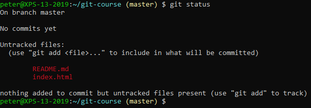
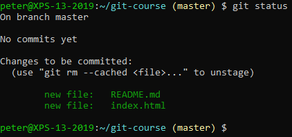

# Adding Commits

First create some files in your repository. You can use your favorite editor, our just create some empty files from the command line:

 
You can see where you are at in your repository by checking the status:

 
Next, stage the files to be committed:

 
Check the status again:

 
**Untracked** files are files that are not yet "tracked" by Git, i.e. they are not yet part of your repository.

Once a file is tracked, any changes will be noticed by Git. But these changes will not automatically be staged (as we will see later).

**Staged** changes are changes to a file that you have added but not yet committed. A commit is an atomic operation where you add changes to the Git log.

Our two files are now ready to be committed. You can do so now:

 
Requesting the status now reveals:
 

