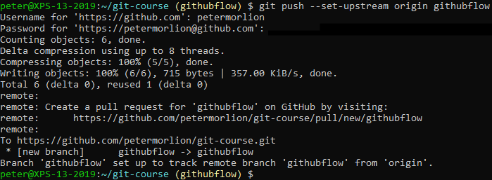
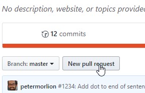
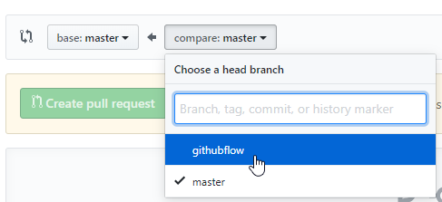
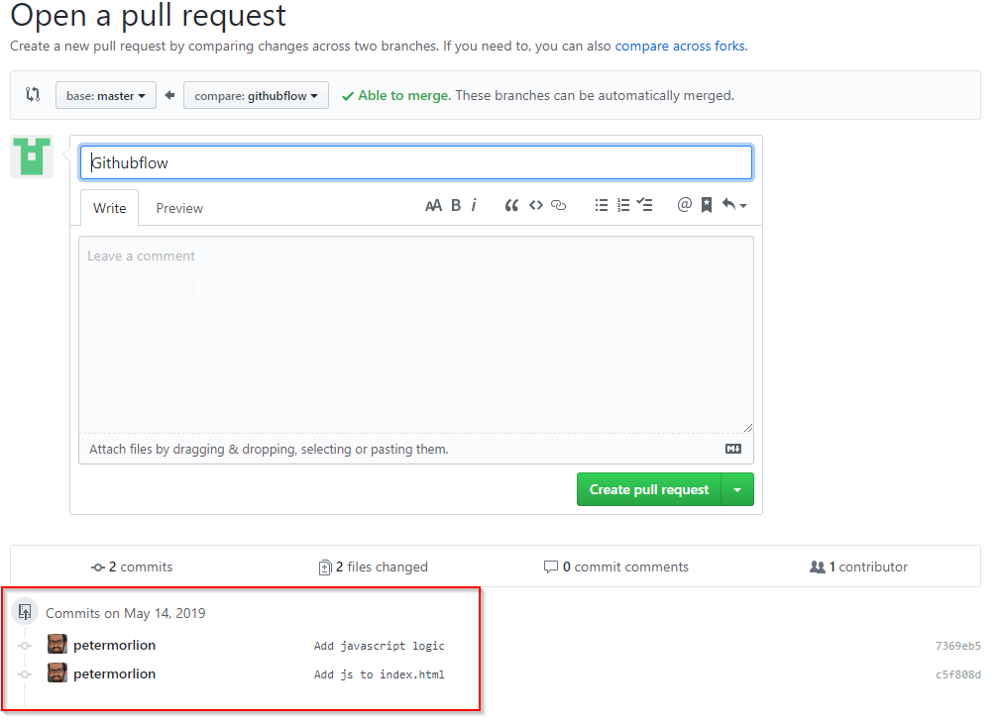

# GitHub Flow

Go to the repository from Part 1 and create a new branch:

Add some commits so the log looks something like this:

Push this branch to the remote:

In the repository on GitHub, click the New Pull Request button:

In the right dropdown, choose the branch that you want to merge.

Verify that your commits are listed:

Add a descriptive message and click the green Create Pull Request button.

You will be taken to the pull request page:

Here you can discuss the pull request with other people that have access to the repository.

Any updates you make to the branch will be reflected in this pull request. Add another commit and push it to the remote to verify.

When you're done, merge the branch into master (whether you fast-forward or not is up to you or your team):

Push the master branch to the remote. The status of the pull request is now Merged:

